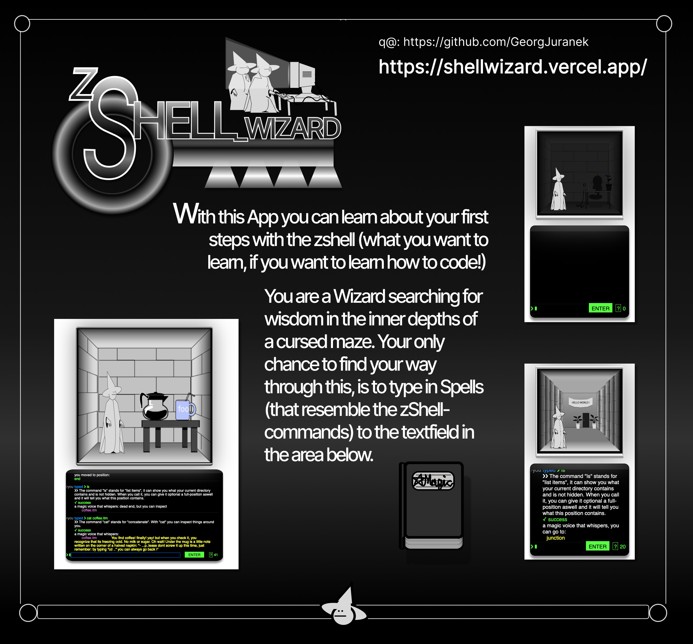
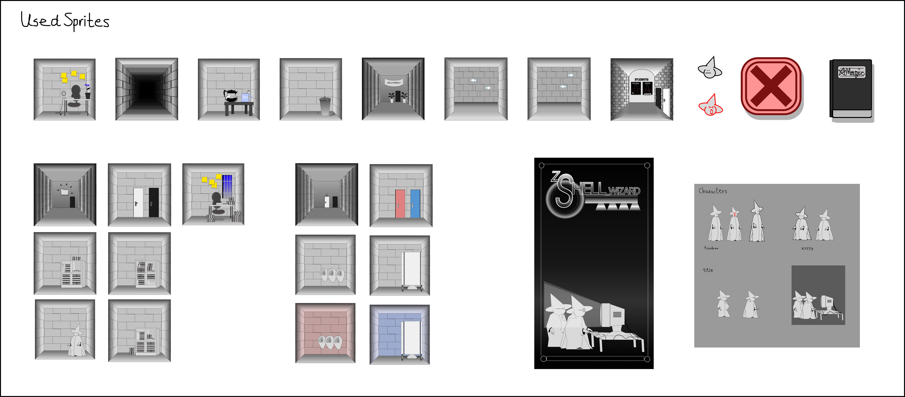

# 
Shell_Wizard 

#

## 📖 Info

Shell_Wizard is a game to learn the zShell-commands.
It was made during the course of a webdevelopment coding-bootcamp.

While you use one side of the screen for typing in the commands in a shell, you get visual feedback on the other side.

As a wizard you explore rooms of a maze, that resembles an office-space.
With the commands you can find a library, private rooms and more. If you get lost on your way, you can use a Spellbook to remember the commands:

This was made as a counter draft to the learning games i played during bootcamp. I tried to make progress more natural and to create an immersive attempt on the to be conveyed content.

I will try to update this from time to time, so if you play it i would be pleased to get some feedback. 
Please note that you can play this on your mobile, even in horizontal-mode, but the most luxerious version will be on a bigger screen.

#

Here are some images i made for the game with figma (https://www.figma.com/) (representations in the game may differ)

#

## 💻 Tech-Stack

- [React](https://reactjs.org/)
- [React Router](https://reactrouter.com/)
- [React Testing Library](https://testing-library.com/)
- [Jest](https://jestjs.io/)
- [Styled Components](https://styled-components.com/)
- [Storybook](https://storybook.js.org/)

## 💾 How to install

- Clone this repository
- Install all dependencies with: `$ npm install`
- Start the project in dev mode: `$ npm start`

## 🪄 Play

- Please have a look at the current version https://shellwizard.vercel.app/
- This is a text-adventure-walking-simulator.
- use `pwd`, `cd`, `ls` and `cat` to explore the rooms.
- Please note that not all plot-relevant events are included yet, so there's no "real ending" (plot will be fixed with future updates).

